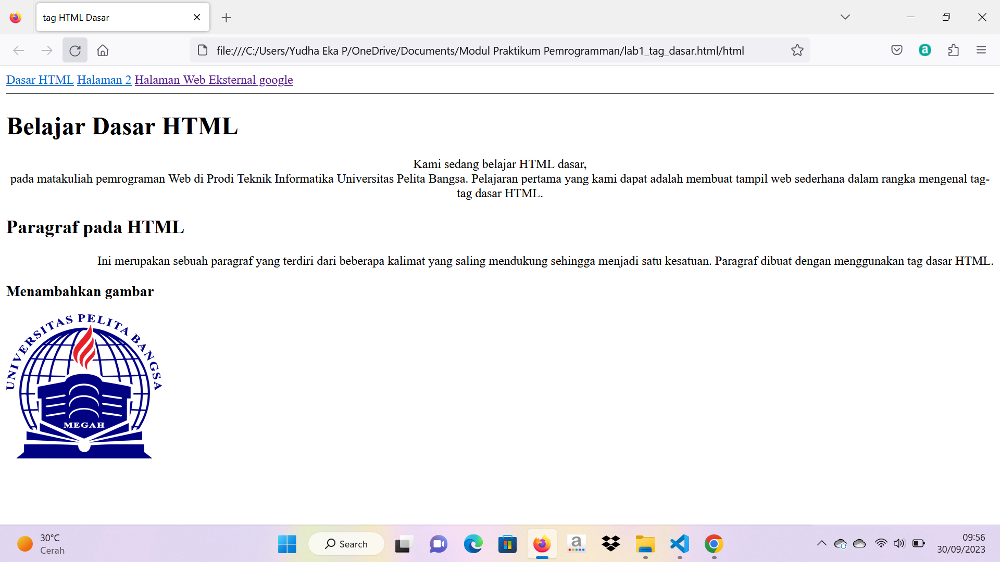

# Belajar_HTML
~~~

2. Tag 
 adalah sebuah Paragraf HTML yang digunakan untuk menandai sekumpulan teks sebagai suatu paragraf untuk menyusun dan menata halaman sehingga menjadi lebih terstruktur dengan baik.

.png)

Tag   dalam HTML digunakan untuk membuat jadi baris (line break) dalam teks atau konten HTML.

3.Atribut title digunakan untuk memberikan informasi tambahan tentang elemen, seperti gambar atau tautan. Ini muncul sebagai tooltip saat pengguna mengarahkan kursor mouse mereka ke elemen tersebut Contoh:<a href="https://www.contoh.com" title="Situs Contoh">Klik di sini</a>

.png)

Atribut alt digunakan untuk memberikan teks alternatif untuk elemen gambar. Ini penting terutama untuk aksesibilitas web karena membantu pengguna yang mungkin tidak dapat melihat gambar tersebut untuk memahami kontennya Contoh: 

.png)
~~~

